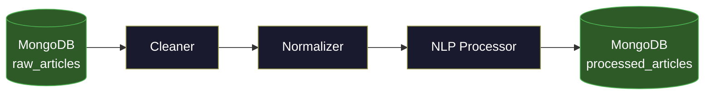

# Member 2: Data Cleaning & Preprocessing

This directory contains the implementation for the **Cleaning & Preprocessing** phase of the Big Data Project.

## Overview
The goal of this module is to transform raw text data (collected by Member 1) into clean, structured data suitable for Machine Learning and Analysis (Member 3).

## Key Features

### 1. Data Cleaning (`cleaner.py`)
- Removes URLS, HTML tags, and spam content.
- Filters out non-ASCII characters (emojis).

### 2. Normalization (`normalizer.py`)
- Standardizes text to lowercase.
- Removes punctuation and numbers.
- Strips extra whitespace.

### 3. NLP Preprocessing (`nlp_processor.py`)
- **Tokenization**: Splits text into words/tokens.
- **Stopword Removal**: Removes common words (and, the, is) using NLTK.
- **Lemmatization**: Converts words to their base form (e.g., "running" -> "running", "cats" -> "cat").

## Pipeline

The main script `pipeline.py` orchestrates these steps:



1.  **Load**: Reads raw data from MongoDB (`raw_articles` collection).
2.  **Process**: Applies Cleaner -> Normalizer -> NLP Processor to each record.
3.  **Save**: Exports the processed data to MongoDB (`processed_articles` collection).


## How to Run

### Manual Execution
```bash
# Install dependencies
pip install -r requirements.txt

# Run the pipeline
python pipeline.py
```

### Testing
Run the unit tests to verify logic:
```bash
python tests.py
```
